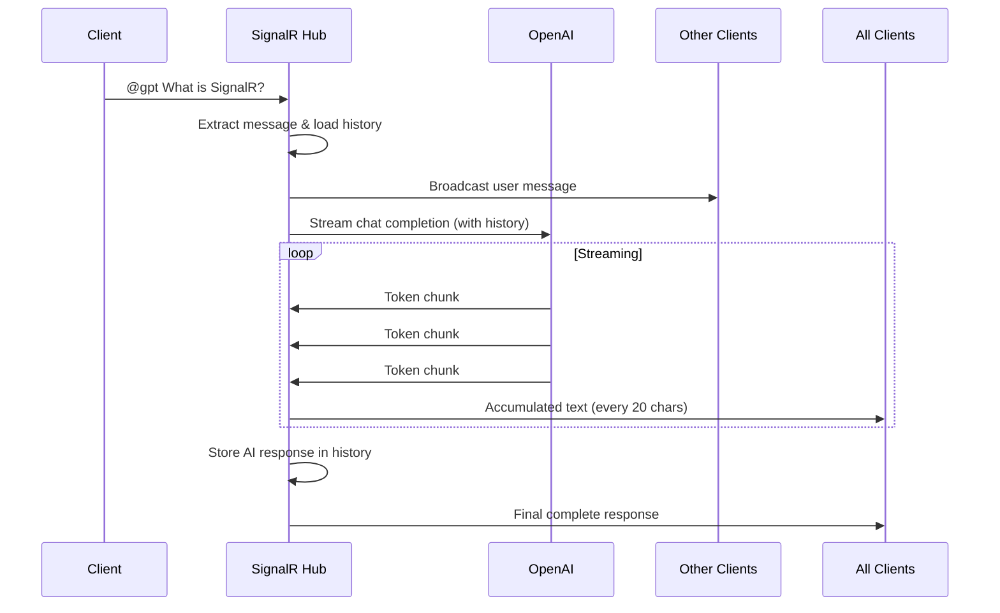

# AI Streaming with SignalR

## Introduction

In the current landscape of digital communication, AI-powered chatbots and streaming technology have become increasingly popular. This project combines these two trends into a seamless group chat application by leveraging **SignalR** for real-time communication and integrating **OpenAI's ChatGPT** for intelligent responses.

This sample demonstrates:
- Real-time group chat using SignalR
- AI-powered responses with ChatGPT integration
- Streaming responses for improved user experience
- Context-aware conversations with chat history

## Features

- **Group Chat Functionality**: Users can create or join groups and participate in a shared chat experience
- **AI Integration**: Interact with an AI chat using the `@gpt` command, seamlessly integrating AI responses into the group chat
- **Real-Time Streaming**: Real-time message streaming ensures all participants receive updates instantly
- **Context-Aware AI**: The AI maintains conversation history to provide contextually relevant responses
- **Progressive Response Delivery**: AI responses are streamed in chunks for a responsive user experience

## Build and Run

### Prerequisites

- [.NET 10.0 SDK](https://dotnet.microsoft.com/download/dotnet/10.0) or later
- **Azure OpenAI** or **OpenAI** account with API access
- A deployed model (for Azure OpenAI) or API key (for OpenAI)

### Configuration

#### Option 1: Azure OpenAI (Default)

1. Configure `appsettings.json`:

```json
{
  "AzureOpenAI": {
    "Endpoint": "https://your-resource-name.openai.azure.com/",
    "Key": "your-api-key-here",
    "DeploymentName": "your-deployment-name"
  }
}
```

2. In `Program.cs`, ensure these lines are **active** (default configuration):

```csharp
// Using Azure OpenAI
builder.Services.AddAzureOpenAI(builder.Configuration);

// Map Azure OpenAI Hub
app.MapHub<GroupChatHubAzureOpenAI>("/groupChat");
```

> **Get credentials**: Follow [this guide](https://learn.microsoft.com/azure/ai-services/openai/chatgpt-quickstart?tabs=command-line%2Cpython-new&pivots=programming-language-csharp#retrieve-key-and-endpoint)

#### Option 2: OpenAI

1. Configure `appsettings.json`:

```json
{
  "OpenAI": {
    "Endpoint": null,
    "Key": "sk-your-openai-api-key",
    "Model": "gpt-4o"
  }
}
```

2. Update `Program.cs` - comment/uncomment the following lines:

```csharp
// Comment out Azure OpenAI:
//builder.Services.AddAzureOpenAI(builder.Configuration);

// Uncomment OpenAI:
builder.Services.AddOpenAI(builder.Configuration);

// Comment out Azure OpenAI Hub:
//app.MapHub<GroupChatHubAzureOpenAI>("/groupChat");

// Uncomment OpenAI Hub:
app.MapHub<GroupChatHubOpenAI>("/groupChat");
```

### Running the Application

1. Clone the repository:
```powershell
git clone https://github.com/microsoft/SignalR-Samples-AI.git
cd SignalR-Samples-AI/src/AIStream
```

2. Run the project:
```powershell
dotnet run
```

3. Open your browser and navigate to `https://localhost:5001` (or the port shown in console)


## How It Works

### Architecture Overview

The application consists of three main components:
- **Frontend**: HTML/JavaScript client using SignalR JavaScript library
- **Backend**: ASP.NET Core with SignalR Hubs (`GroupChatHubAzureOpenAI` or `GroupChatHubOpenAI`)
- **AI Service**: Azure OpenAI or OpenAI API

### 1. Group Chat

When a user sends a regular message (without the `@gpt` command), the following happens:

1. The message is received by the `GroupChatHub`
2. It's stored in the group's chat history via `GroupHistoryStore`
3. The message is broadcast to **all other** group members using `Clients.OthersInGroup()`

**Code snippet from `GroupChatHub.cs`:**
```csharp
else
{
    _history.GetOrAddGroupHistory(groupName, userName, message);
    await Clients.OthersInGroup(groupName).SendAsync("NewMessage", userName, message);
}
```

> **Note**: `OthersInGroup` excludes the sender, so they don't receive their own message twice.

### 2. AI Interaction and Streaming

When a message contains `@gpt`, the application triggers an AI interaction. The workflow involves:

1. **Message Processing**: Extract the actual message and retrieve conversation history
2. **AI Request**: Send the message with full context to OpenAI
3. **Streaming Response**: Receive and forward AI responses in real-time
4. **History Update**: Store the AI's response for future context

#### Understanding Chat Roles

The OpenAI Chat Completions API uses three distinct roles:

| Role | Purpose | Example |
|------|---------|----------|
| **system** | Sets AI behavior and guidelines | "You are a helpful assistant..." |
| **user** | Contains user messages and requests | "John: What is SignalR?" |
| **assistant** | Stores previous AI responses | "SignalR is a library for..." |

#### System Role Configuration

The system role is pre-configured in `GroupHistoryStore.cs` to set the AI's behavior:

```csharp
new SystemChatMessage("""
    You are a friendly and knowledgeable assistant participating in a group discussion. 
    Your role is to provide helpful, accurate, and concise information when addressed. 
    Maintain a respectful tone, ensure your responses are clear and relevant to the group's ongoing conversation, and assist in facilitating productive discussions. 
    Messages from users will be in the format 'UserName: chat messages'. 
    Pay attention to the 'UserName' to understand who is speaking and tailor your responses accordingly.
    """)
```

This configuration ensures the AI:
- Acts as a group chat participant
- Understands the `UserName: message` format
- Provides contextually relevant responses
- Maintains a friendly and helpful tone

#### Storing User Messages

User messages are stored in the `user` role with the format `UserName: message`:

```csharp
public IReadOnlyList<ChatMessage> GetOrAddGroupHistory(string groupName, string userName, string message)
{
    var chatMessages = _store.GetOrAdd(groupName, _ => InitiateChatMessages());
    chatMessages.Add(new UserChatMessage(GenerateUserChatMessage(userName, message)));
    return chatMessages.AsReadOnly();
}

private string GenerateUserChatMessage(string userName, string message)
{
    return $"{userName}: {message}";
}
```

#### Storing AI Responses

AI responses are stored in the `assistant` role:

```csharp
public void UpdateGroupHistoryForAssistant(string groupName, string message)
{
    var chatMessages = _store.GetOrAdd(groupName, _ => InitiateChatMessages());
    chatMessages.Add(new AssistantChatMessage(message));
}
```

> **Important**: Both user and AI messages are preserved in memory to maintain conversation context.

#### Conversation History

To enable context-aware responses, the complete chat history is sent with each AI request:

```csharp
// GroupChatHub.cs
var messagesIncludeHistory = _history.GetOrAddGroupHistory(groupName, userName, actualMessage);
var streamingResult = chatClient.CompleteChatStreamingAsync(messagesIncludeHistory);
```

The `messagesIncludeHistory` contains:
1. **System message** - Role instructions for the AI
2. **All previous user messages** - With usernames included
3. **All previous AI responses** - To maintain context

This allows the AI to:
- ? Remember what was discussed earlier
- ? Understand who said what
- ? Provide contextually relevant follow-up responses
- ? Maintain coherent multi-turn conversations

#### Streaming Workflow

When a user sends a message with `@gpt`, the following happens:

**Step-by-step flow:**

1. **Extract message**: Remove `@gpt` prefix and trim the actual message
2. **Retrieve history**: Get all previous messages for context
3. **Notify group**: Broadcast the user's message to other members
4. **Stream AI response**: Request streaming completion from OpenAI
5. **Progressive updates**: Send chunks to clients every 20 characters
6. **Store response**: Save AI's complete response to history
7. **Final update**: Send the complete response to ensure delivery

**Code implementation:**

```csharp
var streamingResult = chatClient.CompleteChatStreamingAsync(messagesIncludeHistory);
var totalCompletion = new StringBuilder();
var lastSentTokenLength = 0;

await foreach (var update in streamingResult)
{
    if (update.ContentUpdate.Count > 0)
    {
        foreach (var contentPart in update.ContentUpdate)
        {
            totalCompletion.Append(contentPart.Text);
        }

        // Send updates every 20 characters for responsive UX
        if (totalCompletion.Length - lastSentTokenLength > 20)
        {
            await Clients.Group(groupName).SendAsync(
                "newMessageWithId", "AI Assistant", id, totalCompletion.ToString());
            lastSentTokenLength = totalCompletion.Length;
        }
    }
}
```

**Sequence diagram:**



**Why streaming matters:**
- ? Users see responses appear in real-time
- ? Reduces perceived latency
- ? Better user experience for long responses
- ? Allows users to start reading before completion

## Key Files in the Project

| File | Purpose |
|------|---------|
| `Hubs/GroupChatHubAzureOpenAI.cs` | SignalR hub for Azure OpenAI integration |
| `Hubs/GroupChatHubOpenAI.cs` | SignalR hub for OpenAI integration |
| `GroupHistoryStore.cs` | Manages conversation history per group |
| `GroupAccessor.cs` | Tracks which connections belong to which groups |
| `OpenAIExtensions.cs` | Configures Azure OpenAI or OpenAI clients |
| `Program.cs` | Application startup and service configuration |
| `wwwroot/index.html` | Frontend chat interface |
| `wwwroot/js/scripts.js` | SignalR client connection and message handling |## Troubleshooting

### Common Issues

**1. "Not in a group" error**
- Make sure you join a group before sending messages
- Use the group name input and click "Join Group"

**2. AI not responding**
- Verify your API key and endpoint in `appsettings.json`
- Check that messages contain `@gpt` to trigger AI
- Review console logs for API errors

**3. Messages not appearing**
- Check browser console for SignalR connection errors
- Ensure the application is running on `http://localhost:5000`
- Verify firewall/antivirus isn't blocking connections

## Learn More

- [SignalR Documentation](https://learn.microsoft.com/aspnet/core/signalr/introduction)
- [Azure OpenAI Service](https://learn.microsoft.com/azure/ai-services/openai/)
- [OpenAI Chat Completions API](https://platform.openai.com/docs/guides/chat)

## Contributing

This is a sample project from Microsoft. For issues or contributions, please visit the [SignalR-Samples-AI repository](https://github.com/microsoft/SignalR-Samples-AI).

## License

This project is part of the Microsoft SignalR Samples collection and follows the repository's license terms.
